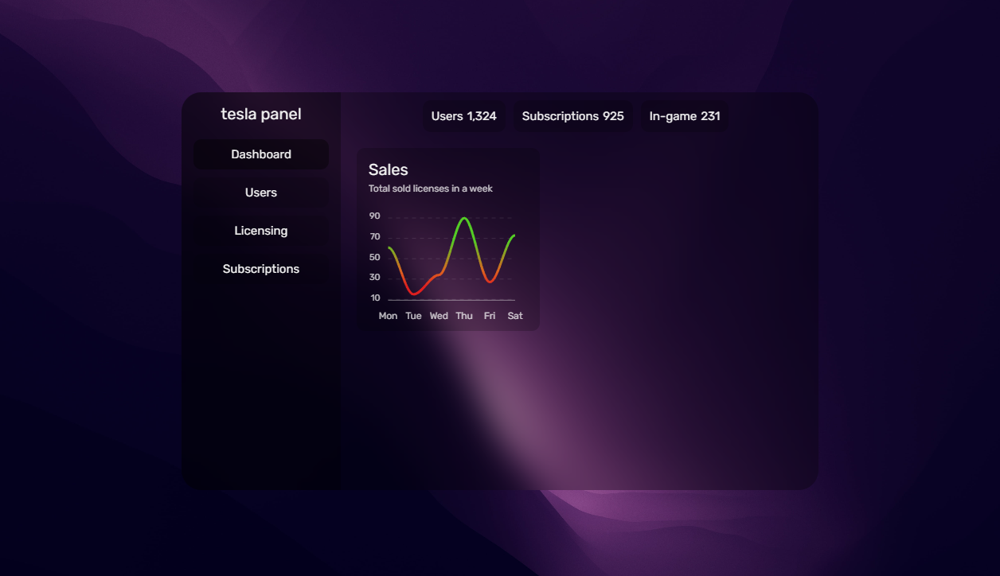

# tesla panel

tesla panel is a modern-looking admin panel designed to provide a sleek and intuitive user interface for managing various aspects of an application or system. This project is a demonstration of design concepts and does not include functional features.

## Features

- Clean and intuitive sidebar navigation
- Dashboard tab displaying key statistics and charts
- Responsive design for seamless viewing on different devices

## Dependencies

- [ApexCharts](https://apexcharts.com/) - Used for creating interactive charts

## Usage

To view the demo of TeslaPanel, simply open the `index.html` file in a web browser.

## Screenshots

